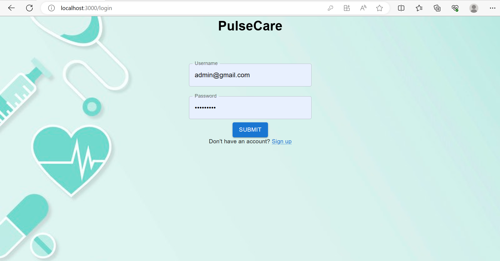

# PulseCare
## A remote patient health monitoring system
### A Medical Internet of Things (M-IoT) based project
We collect real-time vitals data of patients with the help of an analag temperature sensor and a pulse rate sensor(MAX30100) and display it to the patients along with their health status.

    <a href="/">
    

## Landing page
1.  Seamless landing page for user login with the help of `Firebase` Authentication
    

2.  Displaying Pulse rate and Temperature along with Health status
    

3.  Hardware setup with sensors and ESP8266 
    

## Tools Used

## Instructions

1. `git clone https://github.com/Apurva-tech/unite.git` 
2. `cd ./unite`
3. Install node dependencies 
   - `npm install`
4. `npm run dev`
5. The app is now running at http://localhost:3000/landing 